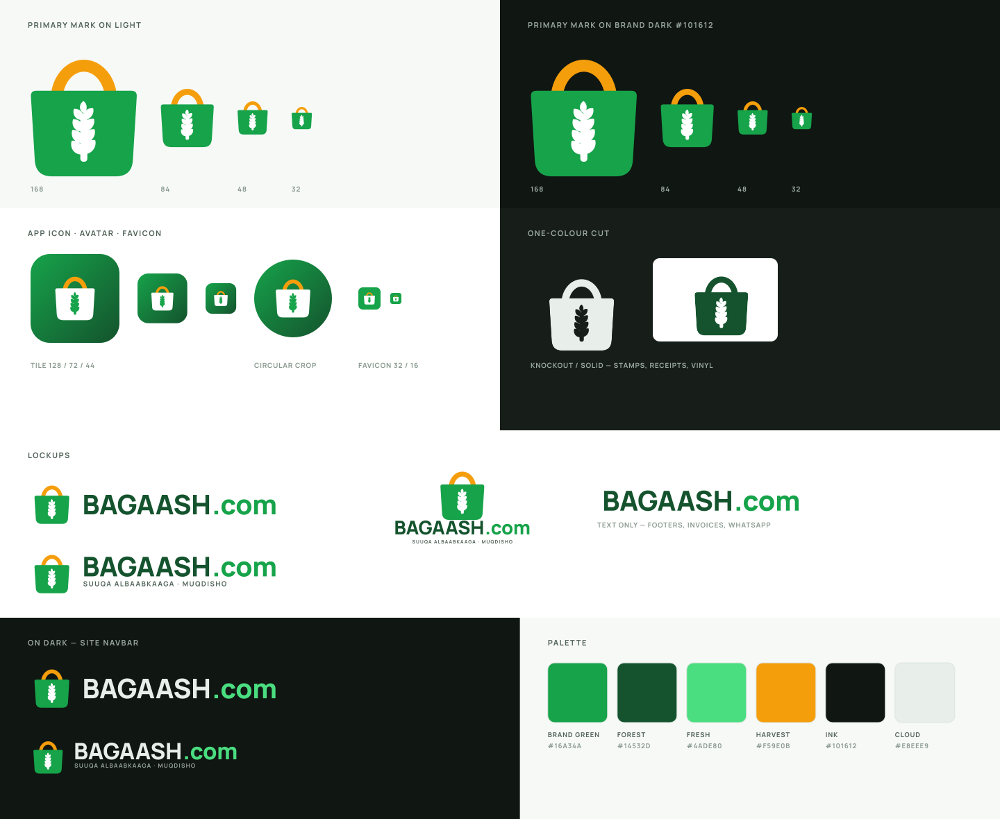

# Bagaash.com — logo & brand marks

Identity for [bagaash.com](https://bagaash.com), the online grocery store
delivering family bundles across Mogadishu, same day.



## The mark

A grocery tote carrying an ear of wheat.

- **The tote** is the *xirmo* — the bundle Bagaash actually sells and carries to
  the door. Its rope handle says the goods are already in hand and moving, which
  is the promise the whole business runs on: order in the morning, delivered the
  same afternoon.
- **The ear of wheat** is the staples at the centre of the range — bariis, bur,
  sonkor, pasta — and is a direct nod to the name: *bagaash* is the word for the
  dry provisions a household stocks. It sits on the face of the bag as a mark of
  contents, the way a sack is stencilled.
- **Green plus harvest gold** keeps the site's own green as the dominant colour
  while the amber it already uses for offers becomes the handle, so the mark
  stays warm rather than clinical.

The silhouette carries the meaning, so the logo survives being shrunk: at 32 px
the bag and handle still read even once the kernels blur together. Below that,
use the tile (`bagaash-favicon.svg`), not the bare mark.

## Palette

Taken from the live site, so these assets drop in without a re-skin.

| Token | Hex | Where it comes from | Use |
| --- | --- | --- | --- |
| Brand green | `#16A34A` | site `theme-color` | the bag; primary buttons, prices |
| Forest | `#14532D` | `--green-light` family | wordmark on light backgrounds, gradient end |
| Fresh | `#4ADE80` | site nav wordmark colour | `.com`, accents on dark |
| Harvest | `#F59E0B` | amber promo accents (`#D97706` family) | the handle; badges, "3rd order free" |
| Ink | `#101612` | `--bg` (dark theme) | dark surfaces |
| Cloud | `#E8EEE9` | `--text` (dark theme) | wordmark on dark backgrounds |

`#D97706` is the darker amber the site uses inline; it is the print-safe
substitute for Harvest when `#F59E0B` prints too bright.

## Files

Every SVG has its text converted to outlines, so nothing depends on the brand
font being installed.

| File | Use |
| --- | --- |
| `bagaash-mark.svg` | the mark alone, full colour, works on light and dark |
| `bagaash-mark-mono.svg` | one colour via `currentColor`; wheat knocked out of the bag |
| `bagaash-logo-horizontal.svg` | primary lockup — headers, invoices, signage |
| `bagaash-logo-horizontal-on-dark.svg` | same, for the dark navbar |
| `bagaash-logo-horizontal-tagline.svg` | with `SUUQA ALBAABKAAGA · MUQDISHO` |
| `bagaash-logo-horizontal-tagline-on-dark.svg` | as above, on dark |
| `bagaash-logo-stacked.svg` | square-ish spaces: flyers, delivery bags, stamps |
| `bagaash-logo-stacked-on-dark.svg` | as above, on dark |
| `bagaash-wordmark.svg` / `-on-dark.svg` | text only — footers, receipts, WhatsApp bio |
| `bagaash-app-icon.svg` | rounded green tile — PWA, WhatsApp Business, social avatar |
| `bagaash-favicon.svg` | small-size cut of the tile, tuned for 16–32 px |

PNG exports sit alongside: `bagaash-mark.png` (512), `bagaash-app-icon.png`
(512) and `-1024.png`, `bagaash-apple-touch-icon.png` (180),
`bagaash-favicon-32.png` (32), and the lockups at 1024/900 wide.

`bagaash-mark-mono.svg` takes its colour from `currentColor`, which only
inherits when the file is inlined in the page. Loaded through `` it
renders black, because an `` SVG is a separate document with no CSS colour
to inherit — inline it, or reach for one of the coloured files instead.

### Wiring up the site

```html
<link rel="icon" href="/assets/brand/bagaash/bagaash-favicon.svg" />
<link rel="apple-touch-icon" href="/assets/brand/bagaash/bagaash-apple-touch-icon.png" />
<meta name="theme-color" content="#16A34A" />
```

## Using it well

- Keep clear space around the logo of at least the height of the bag's handle
  loop on every side.
- Minimum sizes: 24 px tall for the mark, 120 px wide for the horizontal
  lockup, 96 px wide for the stacked one.
- On photographs, place the logo on a solid green or ink panel rather than
  directly on the image.
- Don't recolour the bag, stretch the lockup, add a shadow, or set the wordmark
  in another face — use `bagaash-wordmark.svg` when you need text only.
- The wheat is not a decoration you can swap for another crop; it is the name.

## Regenerating

The artwork is generated, so proportions stay consistent and edits are made once
in the geometry constants rather than by hand in twelve files.

```bash
pip install fonttools uharfbuzz cairosvg
sudo apt-get install -y fonts-manrope librsvg2-bin
python3 build_assets.py
```

The wordmark is Manrope ExtraBold, shaped with HarfBuzz (so kerning is applied)
and written out as outlines. PNGs are rasterised with `rsvg-convert`; cairosvg
is only a fallback, and it mis-renders the `<mask>` behind the one-colour cut.
